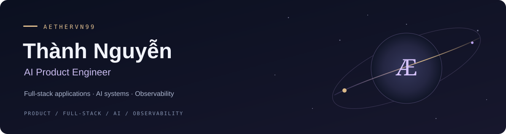

  

<h1 align="center">Hi, I'm Thành Nguyễn 👋</h1>

  <strong>AI &amp; Backend Engineer · RAG · System Design</strong> 
  I connect business workflows, data and AI through software that is clear to understand and practical to operate.

  <a href="https://github.com/aethervn99">GitHub</a> &nbsp;·&nbsp;
  <a href="https://leetcode.com/u/aethervn99/">LeetCode</a>

## About me

My foundation is in **.NET and Node.js backend development**: APIs, authentication, enterprise integrations and order-management workflows. My work has since expanded into **machine learning, LLM applications and RAG**.

- 🧩 At **SmartOSC**, I developed APIs and system integrations for an order management system and picking tool, and contributed to CI/CD and monitoring on AWS.
- 🤖 At **BASAO**, I worked on a real-estate AI proof of concept, contributing to data processing, model training, agent development and deployment on AWS.
- 🧭 At **Lifetek**, I held **Backend Team Lead and Scrum Master** responsibilities, including code reviews, mentoring, requirements analysis and technical estimation.
- 📚 I studied **Software Engineering at FPT University**. I continue to study system design, algorithms and AI evaluation through structured reading and hands-on practice.

## What I'm focusing on

- **RAG and knowledge modeling:** structured knowledge, retrieval quality and clear ownership of changing business data.
- **AI application architecture:** multi-tenant boundaries, guardrails, human handoff and evaluation criteria.
- **Backend reliability:** transactions, idempotency, queues, caching and recovery when a dependency fails.
- **Engineering practice:** tracing a feature from the user interaction through the API, data and operational behavior.

My default is to understand the problem, choose a simple design, make failures explicit and verify the result.

## Selected work

| Work | My contribution | Scope |
| --- | --- | --- |
| Enterprise OMS & picking workflows | Backend APIs, system integration, CI/CD and monitoring with NestJS and AWS | Development & integration at SmartOSC |
| Real-estate AI application | Data processing, model experiments, agents and AWS deployment | Proof of concept at BASAO |
| Service knowledge for RAG | Organized JSONL knowledge and separated service information from pricing | Knowledge preparation for Nàng Sen Spa |
| Multi-tenant AI chatbot | Architecture and estimation covering tenant boundaries, booking intent, guardrails and human handoff | Solution design |

## Languages & tools

**Backend & data**

**AI & knowledge systems**

**Delivery & operations**

Other tools I've used include C#, Express.js, SQL Server, MongoDB, HTML/CSS, Bootstrap and Web3.js.

## Learning in public

- **[Hybrid AI in Flutter workshop](https://github.com/aethervn99/workshop-flutter-gemma-hybrid-ai)** — my fork of [DenisovAV's workshop](https://github.com/DenisovAV/workshop-flutter-gemma-hybrid-ai), kept as a learning reference for cloud/on-device AI, Gemma and RAG.
- **[Algorithm practice on LeetCode](https://leetcode.com/u/aethervn99/)** — building a habit around problem-solving patterns, explaining complexity and revisiting earlier problems.

## Let's connect

I'm interested in **Backend and AI Engineering roles**, and collaboration on APIs, system integration and LLM/RAG applications. I also bring experience in architecture reviews, technical estimation and developer mentoring.

You can find my public work here on [GitHub](https://github.com/aethervn99).
