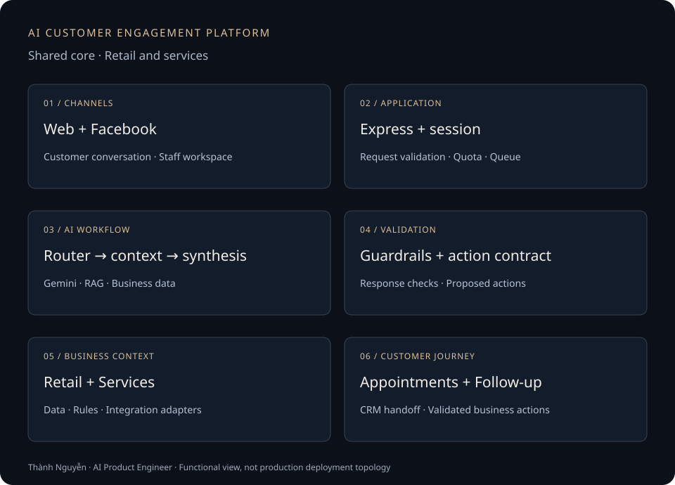

# AI Customer Engagement Platform

**AI consultation and customer care across retail and services.**

I developed the product flows, frontend, backend, business data, AI workflows and integrations end to end. Deployment was handled by a separate team. Client identities are anonymized.

[Back to my profile](../README.md) · [AI Observe](./ai-observe.md)

## The problem

Customers need relevant advice, accurate information and a clear path to an appointment or follow-up. Staff need to maintain the catalog, prices, promotions and branch information behind those answers, and continue working with the resulting conversations.

I applied a shared core architecture to two business contexts:

- **Retail:** understand needs, budget and location; retrieve product information and prices; capture a store visit and continue customer follow-up.
- **Services:** advise on services, prices, promotions and branches; prepare appointment proposals under the relevant booking rules.

The differences sit in business data, rules and integration adapters. Both implementations follow the same consultation-to-action flow.

## What I built

- **Customer and staff experience:** React/TypeScript interfaces for chat, conversation history, customers and administration of business knowledge.
- **Application backend:** Express APIs for Web/Facebook channels, session handling, context restoration, validation and orchestration.
- **AI and data:** Gemini/RAG workflows combining intent routing, retrieved knowledge, structured business data and response synthesis; Firestore persistence.
- **Business integrations:** action contracts, appointment payloads, Pancake CRM handoff and follow-up, including reminder callbacks.
- **Quality controls:** guardrails, provenance/logging, error handling and scenario-based evaluation.

## How a conversation becomes an action

1. A customer starts a conversation on Web or Facebook.
2. The backend restores session context and identifies intent.
3. The workflow retrieves knowledge and loads relevant business facts.
4. The AI prepares an answer or proposes a next step.
5. Application code checks the proposal's structure, supporting facts and business conditions.
6. The integration layer returns the validated payload, and conversation state is recorded for the next turn.

## Engineering decisions

**Use the right source for each fact.** Descriptive knowledge is retrieved through RAG; prices, promotions and branch information come from their business sources. A generated answer does not become the authority for those facts.

**Validate actions in application code.** Model output is a proposal. The services implementation checks facts and booking proposals through a transaction kernel with bounded response repair before handing actions downstream.

**Include the staff workflow.** Administration of knowledge and business data is part of the product, alongside the customer-facing assistant.

**Treat follow-up as part of the customer journey.** Reminder callbacks handle schedule changes, cancellation and repeated requests; they are one capability within the wider platform.

## Validation and limits

Retail reminder checks covered rescheduling, cancellation, stale callbacks and repeated requests. Local integration evaluation used controlled fixtures and simulated downstream boundaries. Those checks apply to reminder behavior, not overall assistant accuracy or completed CRM operations.

The services implementation includes fact/proposal validation, bounded repair and provenance. These mechanisms describe the implementation; they do not establish a measured platform pass rate.

This public case study provides a functional diagram and implementation summary. Client source code, raw evaluation reports and customer conversations are not published here. A validated appointment payload is not evidence that the downstream system completed the booking.

## Outcome and lesson

The delivered application work connects consultation, business knowledge, administration, appointments, CRM handoff and follow-up across two contexts. My ownership covered design, development and integration; deployment remained with the delivery team.

The central lesson: evaluate the quality of an answer and the success of a business action separately. A useful assistant needs both a grounded conversation and an explicit, validated handoff.
