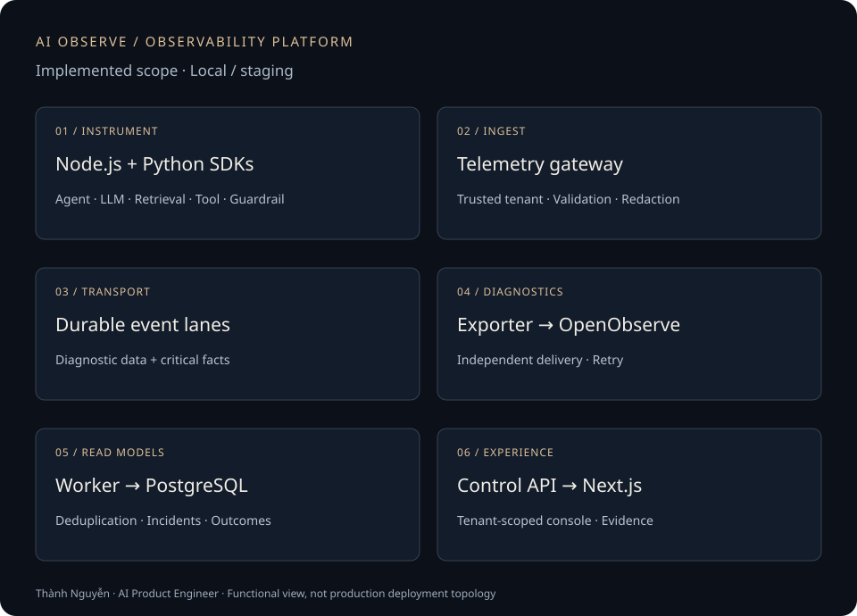

# AI Observe

**AI execution, incidents and business outcomes in one investigation workflow.**

I own the architecture, SDKs, backend, contracts, console, integrations and infrastructure. **Current stage: local/staging.**

[Back to my profile](../README.md) · [AI Customer Engagement Platform](./ai-customer-engagement.md)

## The problem

When an AI request fails, engineers need to find the relevant retrieval, model, tool or validation step. Product teams also need to know whether the requested business action actually happened.

AI Observe connects application telemetry, tenant-scoped read models and a console for investigation. It distinguishes a model response, an attempted action and an authoritative business outcome.

## What I built

- **Node.js and Python SDKs:** instrumentation for agents, LLMs, retrieval, tools and guardrails, with telemetry delivery outside business callbacks.
- **Telemetry plane:** authenticated ingestion, tenant validation, quotas, redaction and diagnostic export.
- **Control plane:** a NestJS/Fastify API, an event worker and PostgreSQL read models for incidents and business impact.
- **Console:** Next.js system views and tenant-scoped dashboards.
- **Contracts and infrastructure:** OpenTelemetry/Protobuf contracts, integration verification and local/staging orchestration. GCP infrastructure configuration is design/configuration work, not a claim of a deployed production service.

## How an investigation works

1. An instrumented application records a conversation turn and processing spans.
2. The SDK queues telemetry with bounded capacity; telemetry failure does not block the business callback by default.
3. The gateway authenticates the sender and checks tenant scope and payloads.
4. Separate consumers export diagnostics and update business read models.
5. The console queries the Control API for coverage, incidents and outcomes within the authorized tenant.
6. Engineers follow an incident into execution evidence to investigate it.

## Engineering decisions

**Keep observability outside the critical business path.** Bounded queues, capped retries and drop counters make telemetry delivery limits visible without turning monitoring into a synchronous dependency of the application.

**Separate traces from business facts.** Diagnostic traces may be sampled. Accepted turns and authoritative outcomes use a separate event lane; dashboards expose completeness and freshness rather than treating missing data as zero.

**Derive tenant scope from authenticated identity.** A tenant value supplied in a payload is not authorization. The control plane uses PostgreSQL row-level security and transaction-scoped tenant context.

**Keep the diagnostic backend replaceable.** OpenTelemetry provides the exchange contract. OpenObserve sits behind an adapter, while the console reads through the Control API.

## Validation and current boundaries

Local verification follows the SDK → gateway → consumer → API/dashboard path. Verification scenarios cover both SDKs, tenant isolation, out-of-order events, retry deduplication, incident lifecycle and a synthetic business outcome.

The retail assistant integration includes local journey evaluation with simulated downstream components. Instrumentation for the services implementation is still in development.

This public case study provides an architecture diagram and implementation summary. It does not publish platform source code, raw test reports or a hosted demo. The confirmed operating scope is local/staging; production availability, customer counts and recovered revenue are not established by these checks.

## Outcome and lesson

AI Observe extends my application work into platform engineering: multi-language SDKs, telemetry ingestion, event processing, data isolation and a frontend connected through a local/staging workflow.

High availability, production SLOs and multi-region expansion remain goals. The key lesson is that observability needs explicit definitions of success: a model finishing its response and a customer's requested action succeeding are different events.
